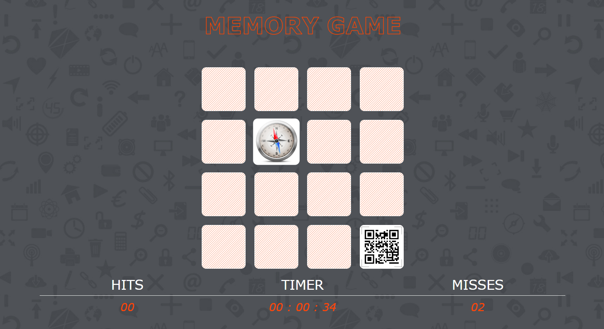

# About Memory Game Project
Hello ! This is my implementation of well known Memory Game. There are 16 cards( 8 pairs in total ).
Try to reveal all the pairs with as few guesses as possible.
 
 

 
# Few words about technical way of game creation..
The app is made with HTML, CSS and Vanilla JavaScript.
Even being well aware that this is a fairly simple project, for the sake of practice I made it using ES6 Modules.
JavaScript code is splitted between app, model, audio and modal scripts.
Event listeners, event delegation, destructuring, higher order array functions... were used with other language features 
in making this game.
Also, I created all of the illustrations and background used in the game.
# Future goal
Multiplayer, multilevel memory game, played across the web in real time.
 
